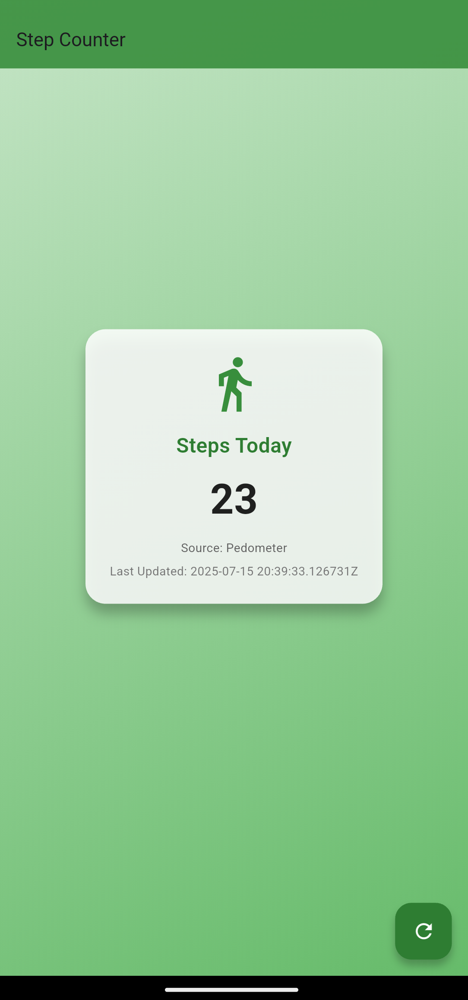
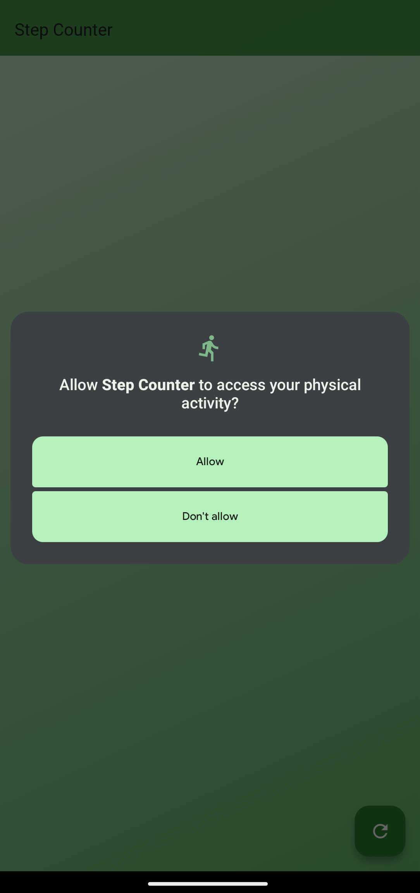
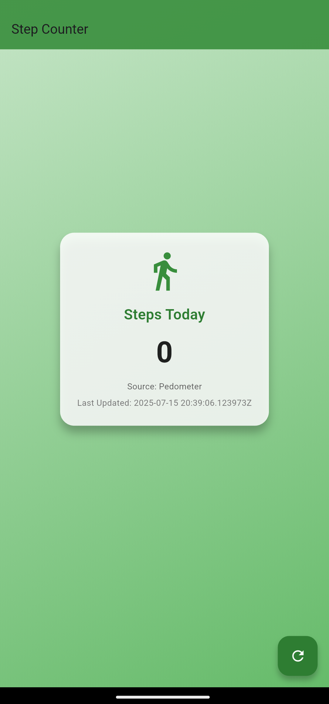

# 🏃‍♂️ Step Counter App – Flutter Assignment

A Flutter application that tracks the user's daily step count using:

- ✅ **Health Connect** (primary source)
- 🔁 **Pedometer** (fallback when Health Connect is unavailable or permission is denied)

---

## 📱 Features

- 📊 **Real-time step count tracking**
- 🔁 **Automatic fallback** to Pedometer if Health Connect is not accessible
- 💾 **Persistent step data storage** using `SharedPreferences`
- 📆 Steps are stored **per day** with ISO-formatted timestamps
- 🔄 **Manual refresh button** to re-fetch or reset step count
- 📤 Displays the **current data source** (Health Connect or Pedometer)
- 🕒 Shows the **last updated time** for steps

---

## 🔧 Setup Instructions

> ⚠️ Works only on **real Android devices** (not emulator)

1. Clone the repository or extract the ZIP file.
   https://github.com/Aashu9798/flutter-step-counter-app
2. In terminal, run:  
   \`\`\`bash
   flutter pub get
   \`\`\`
3. Connect a real Android device with developer mode enabled.
4. Install **Health Connect** from the Google Play Store.
5. Run the app:  
   \`\`\`bash
   flutter run
   \`\`\`
6. Grant all requested permissions when prompted.

---

## 🧪 Testing Guidelines

- Launch the app and **allow Health Connect permissions**
- Walk around with your phone to generate steps
- Tap the **refresh** button to reload the step count
- The app will display:
    - ✅ Total steps
    - ✅ Source of data: `Health Connect` or `Pedometer`
    - ✅ Last updated timestamp
- **Disable Health Connect** or deny permission to test fallback
- Restart the app to confirm **step count persists correctly**

---

## 📂 Data Format (SharedPreferences)

Steps are stored by date in the following format:

\`\`\`json
{
"2025-07-10": {
"steps": 3200,
"lastUpdated": "2025-07-10T15:30:00Z"
}
}
\`\`\`

Additionally, the app stores:

\`\`\`text
initial_<date>
\`\`\`

> Used to track the initial baseline from the pedometer on a given day.

---

## 🛡️ Required Permissions

- `ACTIVITY_RECOGNITION` – for pedometer tracking
- `Health Connect Permissions` – for accessing step count via Health API

---

## 🧰 Packages Used

| Package              | Purpose                                  |
|----------------------|------------------------------------------|
| `health`             | Fetch step data via Health Connect       |
| `pedometer`          | Fallback pedometer stream                |
| `shared_preferences` | Persist step and baseline data           |
| `permission_handler` | Handle Android runtime permissions       |
| `provider`           | State management for step tracking       |

---

## 📸 Screenshots

### 🏠 Home Screen

### ✅ Health Connect Permission Prompt

### 🔁 Pedometer Fallback Example

---

## 👨‍💻 Developed By

**Aashu Shrivastava**  
Flutter Developer  
📧 [aashuraaz727400@gmail.com](mailto:aashuraaz727400@gmail.com)  
🔗 [LinkedIn Profile](https://www.linkedin.com/in/aashu-shrivastava-6279b7259/)

---

## 📬 Submission Link

🔗 GitHub Repository:  
[https://github.com/Aashu9798/flutter-step-counter-app](https://github.com/Aashu9798/flutter-step-counter-app)
